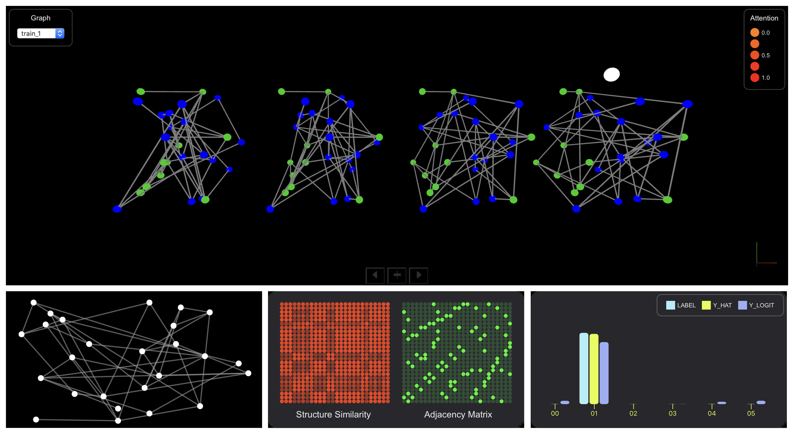

# What a Transformer is Looking at on Graphs?

This is a attention visualization on a Transformer, which was trained on ENZYMES dataset.

## Overview

1. Main View: A 3D rendered scene of graphs. The white sphere represent the CLS token in the last encoder layer. Blue and green sphere represent the different type of nodes.

2. 2D Layout: The bottom left view is the 2D layout of the graph.

3. Adjacency Matrix & Structure Similarity: Structure similarity is calculated from the cosine similarity of each node's structure encoding and ajacency matrix represents the connections among nodes.

4. Output Comparison: Compare the outputs of the trained Transformer to the labels.

## Interactions in Main View

1. Hovering on nodes will show the relavant attention weights between Transformer's encoder layers.

2. Rotating the camera by dragging.

3. Panning the view by WASD keys. Or panning horizontally by the left/right keys at the bottom of Main View.

4. Zooming in/out by N/M keys or srcolling up/down.

5. Pressing H key or the middle key at on bottom of Main View to come back to the origin veiw.

## Used Packages

-   React
-   three.js
-   vx

## Have a Try?

You can check out the deployed version [here](https://blakechi.github.io/graph_vis/).
